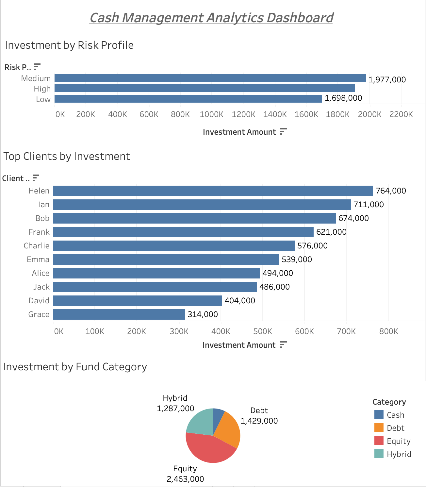

# Cash Management Analytics Platform

Built an end-to-end analytics pipeline simulating asset management workflows, from data modeling to interactive dashboarding.

## Overview
This project simulates a cash management analytics workflow similar to systems used at asset management firms like BlackRock. It integrates SQL and Python to analyze portfolio data, generate client-level insights, and automate reporting outputs.

## Tech Stack
- SQL (PostgreSQL) – data modeling and querying  
- Python (pandas, psycopg2) – data processing and automation  
- Power BI – data visualization (in progress)

## Features
- Relational data modeling for clients, funds, and portfolio holdings  
- SQL joins and aggregation queries for business insights  
- Python-based data pipeline to automate portfolio analysis  
- Export of insights into CSV reports for downstream visualization  

## Key Insights Generated
- Total investment by risk profile  
- Top clients by total investment  
- Investment distribution by fund category

## Business Value
Enables identification of high-value clients, capital concentration across risk profiles, and asset allocation trends for better portfolio decision-making.

## Project Structure
- `/data` → raw datasets  
- `/sql` → SQL scripts (table creation, joins, insights)  
- `/python` → data analysis pipeline  
- `/outputs` → generated business insight reports  
- `/dashboard` → Power BI dashboard (to be added)

## Output Files
- `outputs/total_investment_by_risk_profile.csv`  
- `outputs/total_investment_per_client.csv`  
- `outputs/total_investment_by_fund_category.csv`  
- `outputs/merged_portfolio_analysis.csv`  

## How to Run
1. Set up PostgreSQL database  
2. Run SQL scripts to create tables  
3. Import CSV data into database  
4. Run Python script:

## Why This Project Matters
This project demonstrates:
- End-to-end data pipeline development (SQL → Python → reporting)
- Strong SQL skills including joins and aggregations
- Python-based data analysis and automation
- Ability to translate raw data into actionable business insights

## Live Dashboard (Preview)
Download the Tableau workbook from `/dashboard` or view the preview below.

  ## Dashboard Preview



```bash
python3 python/data_analysis.py
